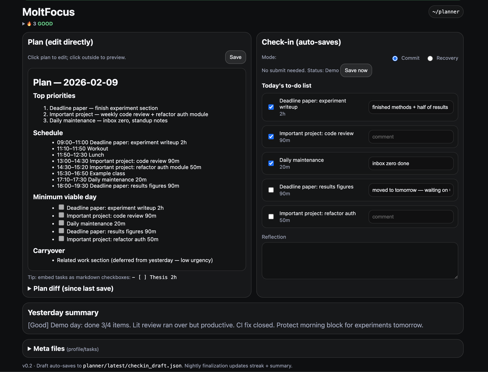
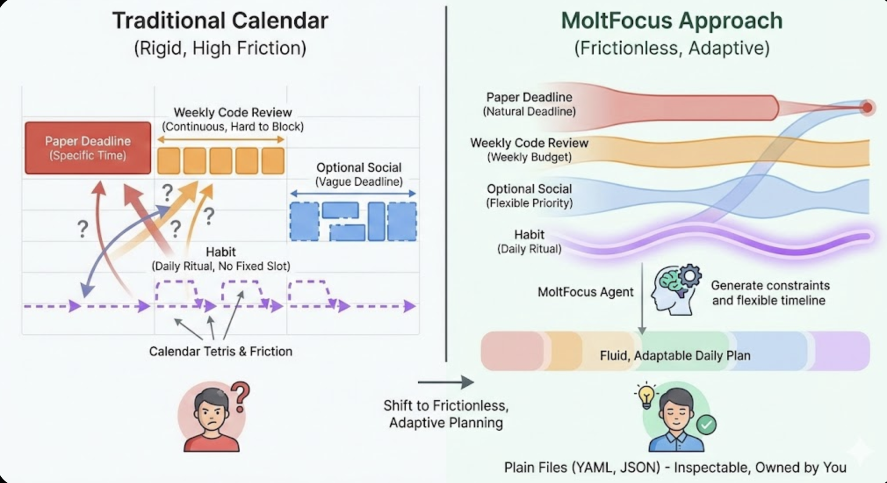

<p align="center">
  
</p>

<p align="center">
  <b>An agent-native daily planner that co-evolves with you.</b><br/>
  A built-in scheduling engine generates your plan. You check in nightly. The system learns your patterns and adapts.
</p>

---

<p align="center">
  
</p>

## Why this exists

<p align="center">
  
</p>

Calendar apps force every task into a time slot. But real priorities are continuous — a paper deadline, a weekly code review, an optional social event, a habit you're trying to keep. Manually bucketing these into rigid calendars creates **friction**, and friction is why planning tools get abandoned.

MoltFocus is designed around three principles:

**1. Reduce friction to zero.** You describe your tasks with natural constraints (deadlines, weekly hour budgets, daily rituals). The built-in scheduling engine generates a time-blocked plan every morning — or an AI agent does it for you. No dragging blocks around, no calendar tetris.

**2. Adapt over time.** Every night you check in: what got done, what didn't, and why. The analytics engine reads your reflections and learns your patterns — which weekdays you focus best, what you tend to skip, whether recovery mode actually helps you. The more you use it, the better the plans get.

**3. Stay in control.** Everything is backed by plain files (YAML, JSON, Markdown) — inspectable, version-controllable, and owned by you. No database, no vendor lock-in, no cloud dependency. You can read every file with a text editor. You can `git diff` your planning history.

## What it does

MoltFocus is a **self-sufficient system** — it works standalone with its built-in intelligence, but also serves as a powerful backend for AI agents that want richer planning capabilities. Here's what's inside:

### Built-in scheduling engine
Describe your work blocks, fixed routines, and weekly events in `profile.yaml`. Define your tasks with priorities, deadlines, and hour budgets in `tasks.yaml`. Run `moltfocus generate` and the [constraint-based scheduler](core/scheduler.py) produces a complete time-blocked plan: priorities, schedule, checkboxes, and carryover. It respects minimum/maximum chunk sizes, inserts buffers, and routes your hardest tasks to your most productive slots.

### Task lifecycle that closes the loop
When you check off items and finalize your day, the system doesn't just log what happened — it [updates your tasks automatically](core/tasks.py). Deadline project hours count down. Weekly budgets track against targets. Tasks auto-complete when remaining hours hit zero. Finished tasks archive themselves. This was previously the agent's manual responsibility; now it's built in.

### Pattern analytics
The [analytics engine](core/analytics.py) parses your entire reflection history and surfaces patterns: completion rates by weekday, most-skipped tasks, rolling 7-day and 30-day averages, recovery mode effectiveness, and streak history. These aren't vanity metrics — they feed directly into scheduling decisions.

### Focus sessions
Start a [Pomodoro-style focus session](core/focus.py) from the CLI or API. Track interruptions. When you stop, elapsed time auto-logs to the task's progress. View stats over any time window.

### Co-evolution bridge
After every finalization, the system generates [`agent_context.json`](core/agent_context.py) — a single file aggregating analytics, urgent tasks, budget status, and scheduling suggestions. An external AI agent reads one file instead of parsing everything. The built-in scheduler reads it too, auto-adjusting plan difficulty based on your recent performance.

### 22-endpoint REST API
Every feature is accessible via [HTTP endpoints](docs/FEATURES.md#8-rest-api-22-endpoints) — task CRUD, analytics, schedule generation, focus sessions, state queries, parsed reflections. Build integrations, connect to Slack, wire up custom dashboards, or let an AI agent orchestrate everything.

### Hook system
[Configure shell commands](core/hooks.py) that fire at lifecycle points: pre/post finalization, plan generation, focus start/stop, task completion. Receive context as JSON via stdin. Integrate with anything.

### Dual interface, zero duplication
A [full Web UI](ui/app.py) (FastAPI + JavaScript) and a [full Terminal UI](cli/moltfocus.py) (Textual) share the same [`core/`](core/) library. Both have plan editing, check-in, finalization, and auto-save. Both are first-class.

## Get started

```bash
git clone https://github.com/JingwenGu0829/MoltFocus.git
cd MoltFocus
./setup.sh
```

The CLI installs dependencies, asks if you want **demo mode** (sample data, instant UI) or **full setup** (your agent personalizes everything), and starts the server.

### Use standalone (no agent needed)

```bash
# Generate today's plan from your profile + tasks
./moltfocus generate

# Launch the interactive TUI
./moltfocus

# Or start the web server
python -m uvicorn ui.app:app --port 8787
```

### Use with an AI agent

For full setup, point your agent at [`ONBOARD_AGENT_OPENCLAW.md`](ONBOARD_AGENT_OPENCLAW.md) — it asks you a few questions, populates your profile and tasks, and sets up daily cron jobs. The agent reads `agent_context.json` for intelligent plan generation and uses the REST API for everything else.

### CLI subcommands

```
moltfocus                    Launch TUI (default)
moltfocus generate           Generate plan using scheduler
  --date YYYY-MM-DD          Generate for a specific date
moltfocus finalize           Run nightly finalization
moltfocus tasks              List tasks with urgency scores
moltfocus analytics          Show analytics summary
moltfocus focus              Show focus session state
  start <id> [label] [min]   Start focus session
  stop [--completed]         Stop focus session
  interrupt                  Record interruption
```

## How it works

The daily cycle:

```
Morning                          Evening                          Overnight
  |                                |                                |
  v                                v                                v
[Generate plan]              [Check in]                      [Finalize]
profile.yaml  ──>  plan.md   checkboxes + reflection   ──>   reflections.md
tasks.yaml                   checkin_draft.json               state.json
                                                              tasks.yaml (progress)
                                                              analytics.json
                                                              agent_context.json
```

1. **Morning**: The scheduler (or your agent) reads your constraints and tasks, generates a time-blocked plan with checkboxes.
2. **Evening**: You check off what you did, add comments, write a short reflection. Everything auto-saves.
3. **Finalize**: A 10-step pipeline computes your rating, updates your streak, logs the reflection, tracks task progress, refreshes analytics, generates agent context, and runs any configured hooks.

The system gets smarter with each cycle. Analytics inform scheduling. Suggestions adjust difficulty. The agent context file bridges built-in intelligence with external AI.

## Detailed features

See **[docs/FEATURES.md](docs/FEATURES.md)** for the complete feature reference covering all 10 subsystems: scheduling engine, task lifecycle, analytics, focus sessions, co-evolution loop, finalization pipeline, dual UI, REST API, hook system, and data model.

## Project structure

```
core/               Shared library — scheduling, analytics, tasks, focus, hooks
  models.py           Typed dataclasses for all data structures
  scheduler.py        Constraint-based plan generation
  analytics.py        Pattern extraction from reflection history
  tasks.py            Task CRUD + lifecycle + progress tracking
  focus.py            Focus session management
  finalize.py         10-step finalization pipeline
  agent_context.py    Intelligence bridge for external agents
  hooks.py            Plugin/hook system
  ...                 (fileio, workspace, checkbox, rating, reflections)
cli/
  moltfocus.py        Terminal UI (Textual) + CLI subcommands
ui/
  app.py              Web UI (FastAPI) + 22 REST endpoints
  static/             Frontend assets (JS, CSS)
tests/                75 tests covering all modules
pyproject.toml        Python packaging with optional dependency groups
```
---

<p align="center">
  <sub>
    <a href="docs/FEATURES.md">Full feature reference</a> ·
    <a href="docs/SETUP.md">Setup guide</a> ·
    <a href="README_AGENT.md">Agent operating instructions</a> ·
    <a href="docs/DATA_MODEL.md">Data model</a>
  </sub>
</p>
